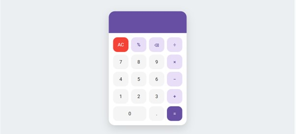

# 🧮 Calculator App

A simple calculator application built using **HTML**, **CSS**, and **JavaScript** with a modern **Material Design** inspired user interface.

## ✨ Features

- ➕ Addition
- ➖ Subtraction
- ✖️ Multiplication
- ➗ Division
- 📊 Percentage (%)
- 🔢 Decimal numbers
- 🗑️ Clear (AC)
- ⌫ Backspace
- ⌨️ Keyboard support
- 📱 Responsive design

## 🚀 Technologies Used

- HTML5
- CSS3
- JavaScript (ES6)

## 📂 Project Structure

```
calculator-app/
│── index.html
│── style.css
│── script.js
└── README.md
```

## ▶️ How to Run

1. Clone this repository

```bash
git clone https://github.com/satriowibowo100806-eng/calculator-app.git
```

2. Open the project folder

```bash
cd calculator-app
```

3. Open `index.html` in your browser

Or use **Live Server** in Visual Studio Code for a better development experience.

## 📸 Preview



> Replace the image above with a screenshot of your application.

## 🌐 Live Demo

https://satriowibowo100806-eng.github.io/calculator/

## 👨‍💻 Author

**Satrio Wibowo**

- GitHub: https://github.com/satriowibowo100806-eng

---

⭐ If you like this project, don't forget to give it a star!